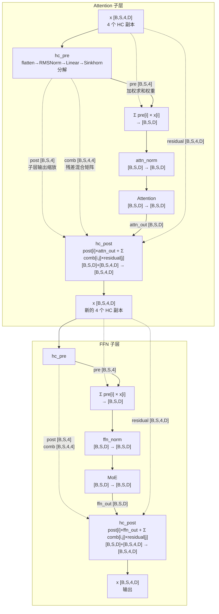

# 模型分析

DeepSeek-V4 发布了两个版本，flash和pro，都支持1M上下文，在架构上做了很大创新

模型报告可以看：[https://huggingface.co/deepseek-ai/DeepSeek-V4-Pro/blob/main/DeepSeek_V4.pdf](https://huggingface.co/deepseek-ai/DeepSeek-V4-Pro/blob/main/DeepSeek_V4.pdf)

模型定义可以看：[https://huggingface.co/deepseek-ai/DeepSeek-V4-Pro/blob/main/inference/model.py](https://huggingface.co/deepseek-ai/DeepSeek-V4-Pro/blob/main/inference/model.py)

主要改动，后面会详细分析：

1. 残差连接使用了mHC ([Manifold-Constrained Hyper-Connections](https://arxiv.org/abs/2512.24880))，实现上多了hc_pre和hc_post
2. 使用三种混合Attention
   - `SWA` (Sliding Window Attention) 滑窗注意力
   - `CSA` (Compressed Sparse Attention) 压缩稀疏注意力，带index的压缩注意力，压缩比4:1
   - `HCA` (Heavily Compressed Attention) 重度压缩注意力，压缩比128:1

3. 前三层是Hash-MoE，后面都还是之前的常规MoE，MoE都采用fp4的权重，其余权重都为fp8
4. 引入了SwiGLU截断（`swiglu_limit`），对expert的up和gate activation做clamp，提升训练稳定性
5. 每层attention增加了可学习的`attn_sink`参数，作为注意力汇防止注意力过度分散

## Attention

### DeepSeek-V4-Flash (43层)

`compress_ratios: [0, 0, 4, 128, 4, 128, ..., 4, 128, 4, 0]`

| 类型                                   | 层号                             | 数量 |
| -------------------------------------- | -------------------------------- | ---- |
| **SWA** (ratio=0)                      | 0, 1                             | 2    |
| **CSA** (ratio=4, 有Indexer, topk=512) | 2, 4, 6, 8, ..., 40, 42 (偶数层) | 21   |
| **HCA** (ratio=128, 无Indexer)         | 3, 5, 7, 9, ..., 39, 41 (奇数层) | 20   |

**模式**: 前两层 SWA → 从第2层起 CSA/HCA 交替 → MTP层 SWA

### DeepSeek-V4-Pro (61层)

`compress_ratios: [128, 128, 4, 128, 4, 128, ..., 4, 128, 4, 0]`

| 类型                                    | 层号                             | 数量 |
| --------------------------------------- | -------------------------------- | ---- |
| **HCA** (ratio=128, 无Indexer)          | 0, 1, 3, 5, 7, ..., 57, 59       | 31   |
| **CSA** (ratio=4, 有Indexer, topk=1024) | 2, 4, 6, 8, ..., 58, 60 (偶数层) | 30   |
| **SWA** (ratio=0)                       | 无                               | 0    |

**模式**: 前两层 HCA → 从第2层起 CSA/HCA 交替 → MTP层 SWA

### 两个模型的差异

1. **开头层不同**: Flash 前2层是纯 SWA（只看局部），Pro 前2层是 HCA（一开始就有长程上下文）
2. **Indexer topk**: Flash=512, Pro=1024（Pro 的 CSA 关注更多压缩位置）
3. **SWA 层数**: Flash 有2层 SWA，Pro 完全没有 SWA（所有层都有长程注意力）

### 三种注意力机制的工作方式

所有有压缩的层都**同时包含**滑窗(128 tokens) + 压缩KV，差异在于压缩部分：

- **SWA**: 仅滑窗128 tokens，无压缩，无长程信息
- **CSA**: 滑窗 + 4:1重叠压缩（overlap=True），Indexer 通过 Q·compressed_KV 打分选出 top-k 个压缩位置进行稀疏关注
- **HCA**: 滑窗 + 128:1非重叠压缩（overlap=False），无 Indexer，均匀关注所有压缩位置

**重叠压缩（overlap）**：CSA的ratio=4时使用重叠压缩，每4个token一组，相邻组之间共享前一组最后ratio个token的信息。具体实现：wkv/wgate输出维度是2×head_dim，前半维度(前d)对应"与前一组重叠"的版本，后半维度(后d)对应"当前组正常"的版本。`overlap_transform`将前一组的[:d]拼接到当前组前面，形成2×ratio个候选，经softmax加权求和后得到1个压缩KV。压缩后KV数量仍然是 seq_len//ratio（与HCA相同），但信息更平滑

1. **三种注意力是同一个公式**：Q 对一条拼接的 KV 序列做一次 softmax attention，不是两路独立再融合
   - KV 序列 = 滑窗原始KV + 压缩KV，位置连续排列

2. **每个 Q 实际参与的 K/V 数量**：
   - SWA：128
   - CSA：128 + min(index_topk, 可用压缩数)
   - HCA：128 + seq_len // 128

   **余数 token 不被压缩但不会丢失**：不够一组 ratio 的尾部 token 可以通过滑窗被关注，压缩部分会忽略他们

   **卡在压缩边界上先压缩再算attention**：decode 时执行顺序是 写滑窗→压缩→attention，当前卡在压缩边界上的token会同时出现在滑窗原始KV和压缩组中

   对Pro来说CSA topk=1024（Flash=512），需要 ≥4096 token 才能选满，HCA则是序列有多长选择多长

## attn_sink（注意力汇）

每层 attention 有一个可学习的 `attn_sink` 参数，形状为 `[n_heads]`（Flash=`[64]`，Pro=`[128]`），作用于 sparse attention 的 softmax 计算中。

### 数学公式

标准 sparse softmax attention 的输出为：

$$o = \frac{\sum_{j \in \text{topk}} e^{s_j - s_{max}} \cdot v_j}{\sum_{j \in \text{topk}} e^{s_j - s_{max}}}$$

加入 `attn_sink` 后，分母增加一项：

$$o = \frac{\sum_{j \in \text{topk}} e^{s_j - s_{max}} \cdot v_j}{\sum_{j \in \text{topk}} e^{s_j - s_{max}} + e^{\text{attn\_sink}_h - s_{max}}}$$

- **分子不变**：`attn_sink` 只出现在分母中，不参与 value 的加权求和
- **分母增大**：每个 head 的注意力权重之和被压缩到 < 1，剩余权重被"sink"吸收
- 对应 kernel 代码（`kernel.py:346`）：`sum_exp[i] += T.exp(attn_sink[i] - scores_max[i])`

### 为什么需要它

在稀疏注意力中尤为重要 — CSA 只看 top-k 个压缩 KV + 128 滑窗，如果这些位置恰好都不相关，没有 `attn_sink` 的话注意力会被迫均匀分散，产生噪声输出。有了它，模型可以选择"不看"，相当于给每个 head 一个"我不确定该看哪里"的逃生出口。

## MoE

每一层的专家都是一个共享专家+路由专家(topk选6个)，对比deepseek-v3前三层是稠密ffn，后面58层是一个共享专家+256个路由专家(topk选8个)

|              | Pro | Flash |
| ------------ | --- | ----- |
| 路由专家数   | 384 | 256   |
| topk         | 6   | 6     |
| shared专家数 | 1   | 1     |

路由专家的参数是fp4，实际在safetensor存储时由于没有4bit存储，是把两个参数打包成一个int8来存储的，详细的可以看文末的权重参数

|                  | Routed Experts          | Shared Experts       |
| ---------------- | ----------------------- | -------------------- |
| **weight**       | FP4 (int8 打包)         | FP8 (float8_e4m3fn)  |
| **scale**        | FP8 (float8_e8m0fnu)    | FP8 (float8_e8m0fnu) |
| **block_size**   | 32                      | 128                  |
| **swiglu_limit** | 10.0 (up:±10, gate:≤10) | 无                   |

前三层的topk是用hash map选择出来的，就是`[129280, 6]`矩阵，129280是词表大小，存储的就是专家id，所以每个token选择的专家是预定义好的，和计算过程和位置等都没有关系

**Hash层没有gate.bias**：Hash-MoE层的gate没有bias参数（专家选择由lookup决定，不需要bias辅助），非Hash层（Pro从第3层起，Flash从第3层起）才有gate.bias用于noaux_tc路由

后面58层就是和常规MoE一样是gate，只是把之前的Softmax/Sigmoid换成了（SqrtSoftPlus），在H200和pro6000上实测了下，SqrtSoftPlus算子性能并没有Softmax好，可能是精度更好吧

**SwiGLU截断**（`swiglu_limit=10.0`）：路由专家的SwiGLU中，up activation被clamp到 [-10, 10]，gate activation被clamp上界到10。shared experts**不使用**截断。这是V4新增的训练稳定性手段

**SqrtSoftPlus**

- 代码：`F.softplus(scores).sqrt()`
- 计算公式：$f(x) = \sqrt{\ln(1 + e^x)}$ ，取值范围：$(0, +\infty)$
- 与 Sigmoid 一样，是逐元素计算的，当 $x$ 非常大时，$\ln(1 + e^x) \approx x$，所以 $f(x) \approx \sqrt{x}$
- 与 Sigmoid 一样，同样必须使用 weights /= weights.sum(...) 来强制归一化，确保最终分配给专家的权重比例合理

## mHC模块

### 整体概览（关注embedding和hc_head，先不看layer层）

这里我们先对整个过程和模块有个大概了解，先不看layer层：

- **embedding** 之后会repeat弄成四份副本，发给layers做计算

- **layer计算完后** 出来的也是四份内容，维度是[B,S,4,D]，通过**hc_head**四个副本加权求和转成[B,S,D]，再经过RMSNorm + lm_head得到logits

```
input_ids
       │
       ↓ Embedding
h: [B, S, D]
       │
       ↓ unsqueeze + repeat   ← [B,S,D] → [B,S,4,D]
h: [B, S, 4, D]
       │
       ↓ layer 0~N-1...
h: [B, S, 4, D]
       │
       ↓ hc_head              ← sigmoid 加权求和, [B,S,4,D] → [B,S,D]
h: [B, S, D]
       │
       ↓ RMSNorm + lm_head-linear
logits: [B, vocab]
```

---

### layer内部分析（hc_pre & hc_post）

单个layer流程分析

输入和输出都是[B,S,4,D]



用四条分支来进行残差相加的好处(mhc)：

- 每层进出的"门控"（pre/post/comb）让模型学会组织和传递跨层信息
- 通过 4×4 双随机矩阵交叉混合融合信息，而不是简单相加
- 极低开销，参数量非常小微乎其微

#### hc_pre 详解：多副本 → 单副本

**作用**: 将 4 个 HC 副本通过可学习权重加权求和为 1 个隐藏状态，送入子层。

**核心流程**:

```
x: [B, S, 4, D]  (4 个 HC 副本)
       │
       ↓ flatten(2) + float32
x: [B, S, 4*D]
       │
       ↓ F.linear(x, hc_fn) * rsqrt   ← RMSNorm + 线性投影
mixes: [B, S, 24]   (24 = pre(4) + post(4) + comb(4×4))
       │
       ↓ hc_split_sinkhorn  ← 分解为三组权重
       ├── pre:  [B, S, 4]     ← 加权求和权重 (sigmoid, 值域 [eps, 1+eps])
       ├── post: [B, S, 4]     ← 子层输出缩放 (2×sigmoid, 值域 [0, 2])
       └── comb: [B, S, 4, 4]  ← 残差混合矩阵 (Sinkhorn 双随机矩阵)
       │
       ↓ y = Σ pre[i] * x_copy[i]
y: [B, S, D]      (合并后的单一隐藏状态)
```

**hc split Sinkhorn 分解的具体计算** (`hc_split_sinkhorn_kernel`):

```
mixes: [n, 24]  (n = B×S, 展平)

1. pre[j]  = sigmoid(mixes[j]      * scale[0] + base[j])      + eps     j=0..3
2. post[j] = 2 * sigmoid(mixes[4+j] * scale[1] + base[4+j])             j=0..3
3. comb[j,k] = mixes[8 + j*4 + k]  * scale[2] + base[8 + j*4 + k]      j,k=0..3

comb 的 Sinkhorn 归一化:
  Step 1: 行 softmax + eps:   comb[j,k] = softmax(comb[j,:]) + eps
  Step 2: 列归一化:           comb[j,k] /= col_sum[k] + eps
  Step 3: 迭代 (sinkhorn_iters-1) = 19 次:
          行归一化:  comb[j,k] /= row_sum[j] + eps
          列归一化:  comb[j,k] /= col_sum[k] + eps
```

**为什么 pre/post/comb 用不同的激活函数？**

- `pre` (sigmoid+eps): 值域 [eps, 1+eps]，保证所有副本都有正贡献，不会完全丢弃
- `post` (2×sigmoid): 值域 [0, 2]，允许子层输出被放大（>1）或缩小（<1），均值约1
- `comb` (Sinkhorn): 双随机矩阵，行和≈1、列和≈1，确保残差信息守恒

---

#### hc_post 详解：单副本 → 多副本

**作用**: 将子层的单一输出扩展回 4 个 HC 副本，并与残差动态混合。

**公式**:

```
new_copy[i] = post[i] × sublayer_output + Σ_j comb[i,j] × residual[j]
```

**逐项解析**:

```
第一项: post[i] × sublayer_output
  post: [B, S, 4, 1]    ← post 权重
  x:    [B, S, 1, D]    ← 子层输出 (插入 HC 维度)
  ──────────────────────
  效果: 每个新副本获得子层输出的不同缩放版本
  post 范围 [0, 2]，不同副本可放大或缩小子层输出

第二项: Σ_j comb[i,j] × residual[j]
  comb:     [B, S, 4, 4, 1]    ← 组合矩阵
  residual: [B, S, 1, 4, D]    ← 残差副本 (插入 comb 输出维度)
  ──────────────────────────────
  沿 dim=2 (源残差副本维度 j) 求和
  效果: 新副本 i = Σ_j comb[i,j] * 旧副本 j
  即 4 个旧副本通过 4×4 双随机矩阵交叉混合

最终: y[i] = post[i] × x + Σ_j comb[i,j] × residual[j]
```

**直觉理解**:

- 子层输出被 `post` 缩放后分发给 4 个副本
- 4 个旧副本通过 `comb` 矩阵"洗牌"重组
- 两者相加形成新的 4 个副本

#### hc_head 详解：最终输出合并

**作用**: 最后一层只需将 4 个 HC 副本合并为 1 个，不需要再扩展回去，因此用简化的 sigmoid 替代 Sinkhorn。

```
x: [B, S, 4, D]
       │
       ↓ flatten(2) + float32
x: [B, S, 4*D]
       │
       ↓ F.linear(x, hc_fn) * rsqrt
mixes: [B, S, 4]          ← 注意: 只有 4 维, 不是 24 维
       │
       ↓ sigmoid + eps
pre: [B, S, 4]            ← 值域 [eps, 1+eps]
       │
       ↓ Σ pre[i] * x_copy[i]
y: [B, S, D]
       │
       ↓ RMSNorm + get_logits(取最后 token)
logits: [B, vocab_size]
```

**hc_head vs hc_pre 的区别**:

|                | hc_pre (Layer内)           | hc_head (输出层) |
| -------------- | -------------------------- | ---------------- |
| 输出维度       | 24 (pre+post+comb)         | 4 (仅pre)        |
| 激活函数       | sigmoid + Sinkhorn         | sigmoid          |
| hc_fn shape    | [24, 4*D]                  | [4, 4*D]         |
| hc_scale shape | [3]                        | [1]              |
| hc_base shape  | [24]                       | [4]              |
| 目的           | 合并 + 为hc_post准备逆变换 | 仅合并           |

## MTPLayer

MTPLayer 继承自 Layer，增加:

- `e_proj` / `h_proj`: 将 embed 和隐藏状态投影后相加（在V3的MTP中是把e和h都经过rmsnorm后concat再通过一个eh_proj做映射，V4把映射分开来了）
- 自己的 `hc_head_fn/base/scale`: 用于 MTP 层的输出合并

```
e = embed(input_ids)                    # [B, S, D]
x = e_proj(enorm(e)).unsqueeze(2)       # [B, S, 1, D]  ← 扩展到 HC 空间
  + h_proj(hnorm(x))                    # [B, S, 4, D]  ← 与原 HC 副本相加
       │
       ↓ Layer.forward (hc_pre → attn → hc_post → hc_pre → ffn → hc_post)
       │
       ↓ hc_head (MTP 自己的 hc_head_fn/base/scale)
       ↓ RMSNorm → get_logits
logits
```

## RoPE与压缩位置编码

- **压缩层使用独立的RoPE参数**：有压缩的层使用 `compress_rope_theta=160000` + YaRN（factor=16, original_seq_len=65536）来支持长上下文位置编码；纯SWA层（ratio=0）使用标准 `rope_theta=10000`，不启用YaRN
- **1M上下文**：YaRN factor=16 × 原始65536 = 支持到1048576（1M token）

# 附录

## 架构图

架构图参考自：https://github.com/CalvinXKY/InfraTech/blob/main/models/deepseek_v4/deepseek_v4_architecture.jpg


## 权重细节

<details><summary>DeepSeek-V4-Pro</summary>

<details><summary>config.json</summary>

```json
{
  "architectures": ["DeepseekV4ForCausalLM"],
  "attention_bias": false,
  "attention_dropout": 0.0,
  "bos_token_id": 0,
  "eos_token_id": 1,
  "hc_eps": 1e-6,
  "hc_mult": 4,
  "hc_sinkhorn_iters": 20,
  "head_dim": 512,
  "hidden_act": "silu",
  "hidden_size": 7168,
  "index_head_dim": 128,
  "index_n_heads": 64,
  "index_topk": 1024,
  "initializer_range": 0.02,
  "max_position_embeddings": 1048576,
  "model_type": "deepseek_v4",
  "moe_intermediate_size": 3072,
  "n_routed_experts": 384,
  "n_shared_experts": 1,
  "norm_topk_prob": true,
  "num_attention_heads": 128,
  "num_experts_per_tok": 6,
  "num_hidden_layers": 61,
  "num_hash_layers": 3,
  "num_key_value_heads": 1,
  "num_nextn_predict_layers": 1,
  "o_groups": 16,
  "o_lora_rank": 1024,
  "q_lora_rank": 1536,
  "qk_rope_head_dim": 64,
  "quantization_config": {
    "activation_scheme": "dynamic",
    "fmt": "e4m3",
    "quant_method": "fp8",
    "scale_fmt": "ue8m0",
    "weight_block_size": [128, 128]
  },
  "rms_norm_eps": 1e-6,
  "rope_scaling": {
    "beta_fast": 32,
    "beta_slow": 1,
    "factor": 16,
    "original_max_position_embeddings": 65536,
    "type": "yarn"
  },
  "rope_theta": 10000,
  "routed_scaling_factor": 2.5,
  "scoring_func": "sqrtsoftplus",
  "sliding_window": 128,
  "swiglu_limit": 10.0,
  "tie_word_embeddings": false,
  "topk_method": "noaux_tc",
  "torch_dtype": "bfloat16",
  "transformers_version": "4.57.1",
  "use_cache": true,
  "vocab_size": 129280,
  "compress_rope_theta": 160000,
  "compress_ratios": [
    128, 128, 4, 128, 4, 128, 4, 128, 4, 128, 4, 128, 4, 128, 4, 128, 4, 128, 4,
    128, 4, 128, 4, 128, 4, 128, 4, 128, 4, 128, 4, 128, 4, 128, 4, 128, 4, 128,
    4, 128, 4, 128, 4, 128, 4, 128, 4, 128, 4, 128, 4, 128, 4, 128, 4, 128, 4,
    128, 4, 128, 4, 0
  ]
}
```

</details>

<details><summary>详细权重列表</summary>

| 权重名称                                                                 | 形状             | 数据类型               | 大小      | 文件                             |
| ------------------------------------------------------------------------ | ---------------- | ---------------------- | --------- | -------------------------------- |
| `embed.weight`                                                           | `[129280, 7168]` | `torch.bfloat16`       | 1.73 GB   | model-00001-of-00064.safetensors |
| `hc_head_base`                                                           | `[4]`            | `torch.float32`        | 16.00 B   | model-00063-of-00064.safetensors |
| `hc_head_fn`                                                             | `[4, 28672]`     | `torch.float32`        | 448.00 KB | model-00063-of-00064.safetensors |
| `hc_head_scale`                                                          | `[1]`            | `torch.float32`        | 4.00 B    | model-00063-of-00064.safetensors |
| `head.weight`                                                            | `[129280, 7168]` | `torch.bfloat16`       | 1.73 GB   | model-00063-of-00064.safetensors |
| `layers.0-1,3,5,...,57,59.attn.compressor.ape` (×31 layers)              | `[128, 512]`     | `torch.float32`        | 7.75 MB   | Multi Files                      |
| `layers.0-1,3,5,...,57,59.attn.compressor.wgate.weight` (×31 layers)     | `[512, 7168]`    | `torch.bfloat16`       | 217.00 MB | Multi Files                      |
| `layers.0-1,3,5,...,57,59.attn.compressor.wkv.weight` (×31 layers)       | `[512, 7168]`    | `torch.bfloat16`       | 217.00 MB | Multi Files                      |
| `layers.0-2.ffn.gate.tid2eid` (×3 layers)                                | `[129280, 6]`    | `torch.int64`          | 17.75 MB  | Multi Files                      |
| `layers.0-60.attn.attn_sink` (×61 layers)                                | `[128]`          | `torch.float32`        | 30.50 KB  | Multi Files                      |
| `layers.0-60.attn.compressor.norm.weight` (×61 layers)                   | `[512]`          | `torch.bfloat16`       | 61.00 KB  | Multi Files                      |
| `layers.0-60.attn.kv_norm.weight` (×61 layers)                           | `[512]`          | `torch.bfloat16`       | 61.00 KB  | Multi Files                      |
| `layers.0-60.attn.q_norm.weight` (×61 layers)                            | `[1536]`         | `torch.bfloat16`       | 183.00 KB | Multi Files                      |
| `layers.0-60.attn.wkv.scale` (×61 layers)                                | `[4, 56]`        | `torch.float8_e8m0fnu` | 13.34 KB  | Multi Files                      |
| `layers.0-60.attn.wkv.weight` (×61 layers)                               | `[512, 7168]`    | `torch.float8_e4m3fn`  | 213.50 MB | Multi Files                      |
| `layers.0-60.attn.wo_a.scale` (×61 layers)                               | `[128, 32]`      | `torch.float8_e8m0fnu` | 244.00 KB | Multi Files                      |
| `layers.0-60.attn.wo_a.weight` (×61 layers)                              | `[16384, 4096]`  | `torch.float8_e4m3fn`  | 3.81 GB   | Multi Files                      |
| `layers.0-60.attn.wo_b.scale` (×61 layers)                               | `[56, 128]`      | `torch.float8_e8m0fnu` | 427.00 KB | Multi Files                      |
| `layers.0-60.attn.wo_b.weight` (×61 layers)                              | `[7168, 16384]`  | `torch.float8_e4m3fn`  | 6.67 GB   | Multi Files                      |
| `layers.0-60.attn.wq_a.scale` (×61 layers)                               | `[12, 56]`       | `torch.float8_e8m0fnu` | 40.03 KB  | Multi Files                      |
| `layers.0-60.attn.wq_a.weight` (×61 layers)                              | `[1536, 7168]`   | `torch.float8_e4m3fn`  | 640.50 MB | Multi Files                      |
| `layers.0-60.attn.wq_b.scale` (×61 layers)                               | `[512, 12]`      | `torch.float8_e8m0fnu` | 366.00 KB | Multi Files                      |
| `layers.0-60.attn.wq_b.weight` (×61 layers)                              | `[65536, 1536]`  | `torch.float8_e4m3fn`  | 5.72 GB   | Multi Files                      |
| `layers.0-60.attn_norm.weight` (×61 layers)                              | `[7168]`         | `torch.bfloat16`       | 854.00 KB | Multi Files                      |
| `layers.0-60.ffn.experts.0-383.w1.scale` (×61 layers, ×384 experts)      | `[3072, 224]`    | `torch.float8_e8m0fnu` | 15.01 GB  | Multi Files                      |
| `layers.0-60.ffn.experts.0-383.w1.weight` (×61 layers, ×384 experts)     | `[3072, 3584]`   | `torch.int8`           | 240.19 GB | Multi Files                      |
| `layers.0-60.ffn.experts.0-383.w2.scale` (×61 layers, ×384 experts)      | `[7168, 96]`     | `torch.float8_e8m0fnu` | 15.01 GB  | Multi Files                      |
| `layers.0-60.ffn.experts.0-383.w2.weight` (×61 layers, ×384 experts)     | `[7168, 1536]`   | `torch.int8`           | 240.19 GB | Multi Files                      |
| `layers.0-60.ffn.experts.0-383.w3.scale` (×61 layers, ×384 experts)      | `[3072, 224]`    | `torch.float8_e8m0fnu` | 15.01 GB  | Multi Files                      |
| `layers.0-60.ffn.experts.0-383.w3.weight` (×61 layers, ×384 experts)     | `[3072, 3584]`   | `torch.int8`           | 240.19 GB | Multi Files                      |
| `layers.0-60.ffn.gate.weight` (×61 layers)                               | `[384, 7168]`    | `torch.bfloat16`       | 320.25 MB | Multi Files                      |
| `layers.0-60.ffn.shared_experts.w1.scale` (×61 layers)                   | `[24, 56]`       | `torch.float8_e8m0fnu` | 80.06 KB  | Multi Files                      |
| `layers.0-60.ffn.shared_experts.w1.weight` (×61 layers)                  | `[3072, 7168]`   | `torch.float8_e4m3fn`  | 1.25 GB   | Multi Files                      |
| `layers.0-60.ffn.shared_experts.w2.scale` (×61 layers)                   | `[56, 24]`       | `torch.float8_e8m0fnu` | 80.06 KB  | Multi Files                      |
| `layers.0-60.ffn.shared_experts.w2.weight` (×61 layers)                  | `[7168, 3072]`   | `torch.float8_e4m3fn`  | 1.25 GB   | Multi Files                      |
| `layers.0-60.ffn.shared_experts.w3.scale` (×61 layers)                   | `[24, 56]`       | `torch.float8_e8m0fnu` | 80.06 KB  | Multi Files                      |
| `layers.0-60.ffn.shared_experts.w3.weight` (×61 layers)                  | `[3072, 7168]`   | `torch.float8_e4m3fn`  | 1.25 GB   | Multi Files                      |
| `layers.0-60.ffn_norm.weight` (×61 layers)                               | `[7168]`         | `torch.bfloat16`       | 854.00 KB | Multi Files                      |
| `layers.0-60.hc_attn_base` (×61 layers)                                  | `[24]`           | `torch.float32`        | 5.72 KB   | Multi Files                      |
| `layers.0-60.hc_attn_fn` (×61 layers)                                    | `[24, 28672]`    | `torch.float32`        | 160.12 MB | Multi Files                      |
| `layers.0-60.hc_attn_scale` (×61 layers)                                 | `[3]`            | `torch.float32`        | 732.00 B  | Multi Files                      |
| `layers.0-60.hc_ffn_base` (×61 layers)                                   | `[24]`           | `torch.float32`        | 5.72 KB   | Multi Files                      |
| `layers.0-60.hc_ffn_fn` (×61 layers)                                     | `[24, 28672]`    | `torch.float32`        | 160.12 MB | Multi Files                      |
| `layers.0-60.hc_ffn_scale` (×61 layers)                                  | `[3]`            | `torch.float32`        | 732.00 B  | Multi Files                      |
| `layers.2,4,...,58,60.attn.compressor.ape` (×30 layers)                  | `[4, 1024]`      | `torch.float32`        | 480.00 KB | Multi Files                      |
| `layers.2,4,...,58,60.attn.compressor.wgate.weight` (×30 layers)         | `[1024, 7168]`   | `torch.bfloat16`       | 420.00 MB | Multi Files                      |
| `layers.2,4,...,58,60.attn.compressor.wkv.weight` (×30 layers)           | `[1024, 7168]`   | `torch.bfloat16`       | 420.00 MB | Multi Files                      |
| `layers.2,4,...,58,60.attn.indexer.compressor.ape` (×30 layers)          | `[4, 256]`       | `torch.float32`        | 120.00 KB | Multi Files                      |
| `layers.2,4,...,58,60.attn.indexer.compressor.norm.weight` (×30 layers)  | `[128]`          | `torch.bfloat16`       | 7.50 KB   | Multi Files                      |
| `layers.2,4,...,58,60.attn.indexer.compressor.wgate.weight` (×30 layers) | `[256, 7168]`    | `torch.bfloat16`       | 105.00 MB | Multi Files                      |
| `layers.2,4,...,58,60.attn.indexer.compressor.wkv.weight` (×30 layers)   | `[256, 7168]`    | `torch.bfloat16`       | 105.00 MB | Multi Files                      |
| `layers.2,4,...,58,60.attn.indexer.weights_proj.weight` (×30 layers)     | `[64, 7168]`     | `torch.bfloat16`       | 26.25 MB  | Multi Files                      |
| `layers.2,4,...,58,60.attn.indexer.wq_b.scale` (×30 layers)              | `[64, 12]`       | `torch.float8_e8m0fnu` | 22.50 KB  | Multi Files                      |
| `layers.2,4,...,58,60.attn.indexer.wq_b.weight` (×30 layers)             | `[8192, 1536]`   | `torch.float8_e4m3fn`  | 360.00 MB | Multi Files                      |
| `layers.3-60.ffn.gate.bias` (×58 layers)                                 | `[384]`          | `torch.float32`        | 87.00 KB  | Multi Files                      |
| `mtp.0.attn.attn_sink`                                                   | `[128]`          | `torch.float32`        | 512.00 B  | model-00064-of-00064.safetensors |
| `mtp.0.attn.kv_norm.weight`                                              | `[512]`          | `torch.bfloat16`       | 1.00 KB   | model-00064-of-00064.safetensors |
| `mtp.0.attn.q_norm.weight`                                               | `[1536]`         | `torch.bfloat16`       | 3.00 KB   | model-00064-of-00064.safetensors |
| `mtp.0.attn.wkv.scale`                                                   | `[4, 56]`        | `torch.float8_e8m0fnu` | 224.00 B  | model-00064-of-00064.safetensors |
| `mtp.0.attn.wkv.weight`                                                  | `[512, 7168]`    | `torch.float8_e4m3fn`  | 3.50 MB   | model-00064-of-00064.safetensors |
| `mtp.0.attn.wo_a.scale`                                                  | `[128, 32]`      | `torch.float8_e8m0fnu` | 4.00 KB   | model-00064-of-00064.safetensors |
| `mtp.0.attn.wo_a.weight`                                                 | `[16384, 4096]`  | `torch.float8_e4m3fn`  | 64.00 MB  | model-00064-of-00064.safetensors |
| `mtp.0.attn.wo_b.scale`                                                  | `[56, 128]`      | `torch.float8_e8m0fnu` | 7.00 KB   | model-00064-of-00064.safetensors |
| `mtp.0.attn.wo_b.weight`                                                 | `[7168, 16384]`  | `torch.float8_e4m3fn`  | 112.00 MB | model-00064-of-00064.safetensors |
| `mtp.0.attn.wq_a.scale`                                                  | `[12, 56]`       | `torch.float8_e8m0fnu` | 672.00 B  | model-00064-of-00064.safetensors |
| `mtp.0.attn.wq_a.weight`                                                 | `[1536, 7168]`   | `torch.float8_e4m3fn`  | 10.50 MB  | model-00064-of-00064.safetensors |
| `mtp.0.attn.wq_b.scale`                                                  | `[512, 12]`      | `torch.float8_e8m0fnu` | 6.00 KB   | model-00064-of-00064.safetensors |
| `mtp.0.attn.wq_b.weight`                                                 | `[65536, 1536]`  | `torch.float8_e4m3fn`  | 96.00 MB  | model-00064-of-00064.safetensors |
| `mtp.0.attn_norm.weight`                                                 | `[7168]`         | `torch.bfloat16`       | 14.00 KB  | model-00064-of-00064.safetensors |
| `mtp.0.e_proj.scale`                                                     | `[56, 56]`       | `torch.float8_e8m0fnu` | 3.06 KB   | model-00064-of-00064.safetensors |
| `mtp.0.e_proj.weight`                                                    | `[7168, 7168]`   | `torch.float8_e4m3fn`  | 49.00 MB  | model-00064-of-00064.safetensors |
| `mtp.0.enorm.weight`                                                     | `[7168]`         | `torch.bfloat16`       | 14.00 KB  | model-00064-of-00064.safetensors |
| `mtp.0.ffn.experts.0-383.w1.scale` (×384 experts)                        | `[3072, 224]`    | `torch.float8_e8m0fnu` | 252.00 MB | model-00064-of-00064.safetensors |
| `mtp.0.ffn.experts.0-383.w1.weight` (×384 experts)                       | `[3072, 3584]`   | `torch.int8`           | 3.94 GB   | model-00064-of-00064.safetensors |
| `mtp.0.ffn.experts.0-383.w2.scale` (×384 experts)                        | `[7168, 96]`     | `torch.float8_e8m0fnu` | 252.00 MB | model-00064-of-00064.safetensors |
| `mtp.0.ffn.experts.0-383.w2.weight` (×384 experts)                       | `[7168, 1536]`   | `torch.int8`           | 3.94 GB   | model-00064-of-00064.safetensors |
| `mtp.0.ffn.experts.0-383.w3.scale` (×384 experts)                        | `[3072, 224]`    | `torch.float8_e8m0fnu` | 252.00 MB | model-00064-of-00064.safetensors |
| `mtp.0.ffn.experts.0-383.w3.weight` (×384 experts)                       | `[3072, 3584]`   | `torch.int8`           | 3.94 GB   | model-00064-of-00064.safetensors |
| `mtp.0.ffn.gate.bias`                                                    | `[384]`          | `torch.float32`        | 1.50 KB   | model-00064-of-00064.safetensors |
| `mtp.0.ffn.gate.weight`                                                  | `[384, 7168]`    | `torch.bfloat16`       | 5.25 MB   | model-00064-of-00064.safetensors |
| `mtp.0.ffn.shared_experts.w1.scale`                                      | `[24, 56]`       | `torch.float8_e8m0fnu` | 1.31 KB   | model-00064-of-00064.safetensors |
| `mtp.0.ffn.shared_experts.w1.weight`                                     | `[3072, 7168]`   | `torch.float8_e4m3fn`  | 21.00 MB  | model-00064-of-00064.safetensors |
| `mtp.0.ffn.shared_experts.w2.scale`                                      | `[56, 24]`       | `torch.float8_e8m0fnu` | 1.31 KB   | model-00064-of-00064.safetensors |
| `mtp.0.ffn.shared_experts.w2.weight`                                     | `[7168, 3072]`   | `torch.float8_e4m3fn`  | 21.00 MB  | model-00064-of-00064.safetensors |
| `mtp.0.ffn.shared_experts.w3.scale`                                      | `[24, 56]`       | `torch.float8_e8m0fnu` | 1.31 KB   | model-00064-of-00064.safetensors |
| `mtp.0.ffn.shared_experts.w3.weight`                                     | `[3072, 7168]`   | `torch.float8_e4m3fn`  | 21.00 MB  | model-00064-of-00064.safetensors |
| `mtp.0.ffn_norm.weight`                                                  | `[7168]`         | `torch.bfloat16`       | 14.00 KB  | model-00064-of-00064.safetensors |
| `mtp.0.h_proj.scale`                                                     | `[56, 56]`       | `torch.float8_e8m0fnu` | 3.06 KB   | model-00064-of-00064.safetensors |
| `mtp.0.h_proj.weight`                                                    | `[7168, 7168]`   | `torch.float8_e4m3fn`  | 49.00 MB  | model-00064-of-00064.safetensors |
| `mtp.0.hc_attn_base`                                                     | `[24]`           | `torch.float32`        | 96.00 B   | model-00064-of-00064.safetensors |
| `mtp.0.hc_attn_fn`                                                       | `[24, 28672]`    | `torch.float32`        | 2.62 MB   | model-00064-of-00064.safetensors |
| `mtp.0.hc_attn_scale`                                                    | `[3]`            | `torch.float32`        | 12.00 B   | model-00064-of-00064.safetensors |
| `mtp.0.hc_ffn_base`                                                      | `[24]`           | `torch.float32`        | 96.00 B   | model-00064-of-00064.safetensors |
| `mtp.0.hc_ffn_fn`                                                        | `[24, 28672]`    | `torch.float32`        | 2.62 MB   | model-00064-of-00064.safetensors |
| `mtp.0.hc_ffn_scale`                                                     | `[3]`            | `torch.float32`        | 12.00 B   | model-00064-of-00064.safetensors |
| `mtp.0.hc_head_base`                                                     | `[4]`            | `torch.float32`        | 16.00 B   | model-00064-of-00064.safetensors |
| `mtp.0.hc_head_fn`                                                       | `[4, 28672]`     | `torch.float32`        | 448.00 KB | model-00064-of-00064.safetensors |
| `mtp.0.hc_head_scale`                                                    | `[1]`            | `torch.float32`        | 4.00 B    | model-00064-of-00064.safetensors |
| `mtp.0.hnorm.weight`                                                     | `[7168]`         | `torch.bfloat16`       | 14.00 KB  | model-00064-of-00064.safetensors |
| `mtp.0.norm.weight`                                                      | `[7168]`         | `torch.bfloat16`       | 14.00 KB  | model-00064-of-00064.safetensors |
| `norm.weight`                                                            | `[7168]`         | `torch.bfloat16`       | 14.00 KB  | model-00063-of-00064.safetensors |

</details>

</details>

<details><summary>DeepSeek-V4-Flash</summary>

<details><summary>config.json</summary>

```json
{
  "architectures": ["DeepseekV4ForCausalLM"],
  "attention_bias": false,
  "attention_dropout": 0.0,
  "bos_token_id": 0,
  "eos_token_id": 1,
  "hc_eps": 1e-6,
  "hc_mult": 4,
  "hc_sinkhorn_iters": 20,
  "head_dim": 512,
  "hidden_act": "silu",
  "hidden_size": 4096,
  "index_head_dim": 128,
  "index_n_heads": 64,
  "index_topk": 512,
  "initializer_range": 0.02,
  "max_position_embeddings": 1048576,
  "model_type": "deepseek_v4",
  "moe_intermediate_size": 2048,
  "n_routed_experts": 256,
  "n_shared_experts": 1,
  "norm_topk_prob": true,
  "num_attention_heads": 64,
  "num_experts_per_tok": 6,
  "num_hidden_layers": 43,
  "num_hash_layers": 3,
  "num_key_value_heads": 1,
  "num_nextn_predict_layers": 1,
  "o_groups": 8,
  "o_lora_rank": 1024,
  "q_lora_rank": 1024,
  "qk_rope_head_dim": 64,
  "quantization_config": {
    "activation_scheme": "dynamic",
    "fmt": "e4m3",
    "quant_method": "fp8",
    "scale_fmt": "ue8m0",
    "weight_block_size": [128, 128]
  },
  "rms_norm_eps": 1e-6,
  "rope_scaling": {
    "beta_fast": 32,
    "beta_slow": 1,
    "factor": 16,
    "original_max_position_embeddings": 65536,
    "type": "yarn"
  },
  "rope_theta": 10000,
  "routed_scaling_factor": 1.5,
  "scoring_func": "sqrtsoftplus",
  "sliding_window": 128,
  "swiglu_limit": 10.0,
  "tie_word_embeddings": false,
  "topk_method": "noaux_tc",
  "torch_dtype": "bfloat16",
  "transformers_version": "4.57.1",
  "use_cache": true,
  "vocab_size": 129280,
  "compress_rope_theta": 160000,
  "compress_ratios": [
    0, 0, 4, 128, 4, 128, 4, 128, 4, 128, 4, 128, 4, 128, 4, 128, 4, 128, 4,
    128, 4, 128, 4, 128, 4, 128, 4, 128, 4, 128, 4, 128, 4, 128, 4, 128, 4, 128,
    4, 128, 4, 128, 4, 0
  ]
}
```

</details>

<details><summary>详细权重列表</summary>

| 权重名称                                                                 | 形状             | 数据类型               | 大小       | 文件                             |
| ------------------------------------------------------------------------ | ---------------- | ---------------------- | ---------- | -------------------------------- |
| `embed.weight`                                                           | `[129280, 4096]` | `torch.bfloat16`       | 1010.00 MB | model-00001-of-00046.safetensors |
| `hc_head_base`                                                           | `[4]`            | `torch.float32`        | 16.00 B    | model-00045-of-00046.safetensors |
| `hc_head_fn`                                                             | `[4, 16384]`     | `torch.float32`        | 256.00 KB  | model-00045-of-00046.safetensors |
| `hc_head_scale`                                                          | `[1]`            | `torch.float32`        | 4.00 B     | model-00045-of-00046.safetensors |
| `head.weight`                                                            | `[129280, 4096]` | `torch.bfloat16`       | 1010.00 MB | model-00045-of-00046.safetensors |
| `layers.0-2.ffn.gate.tid2eid` (×3 layers)                                | `[129280, 6]`    | `torch.int64`          | 17.75 MB   | Multi Files                      |
| `layers.0-42.attn.attn_sink` (×43 layers)                                | `[64]`           | `torch.float32`        | 10.75 KB   | Multi Files                      |
| `layers.0-42.attn.kv_norm.weight` (×43 layers)                           | `[512]`          | `torch.bfloat16`       | 43.00 KB   | Multi Files                      |
| `layers.0-42.attn.q_norm.weight` (×43 layers)                            | `[1024]`         | `torch.bfloat16`       | 86.00 KB   | Multi Files                      |
| `layers.0-42.attn.wkv.scale` (×43 layers)                                | `[4, 32]`        | `torch.float8_e8m0fnu` | 5.38 KB    | Multi Files                      |
| `layers.0-42.attn.wkv.weight` (×43 layers)                               | `[512, 4096]`    | `torch.float8_e4m3fn`  | 86.00 MB   | Multi Files                      |
| `layers.0-42.attn.wo_a.scale` (×43 layers)                               | `[64, 32]`       | `torch.float8_e8m0fnu` | 86.00 KB   | Multi Files                      |
| `layers.0-42.attn.wo_a.weight` (×43 layers)                              | `[8192, 4096]`   | `torch.float8_e4m3fn`  | 1.34 GB    | Multi Files                      |
| `layers.0-42.attn.wo_b.scale` (×43 layers)                               | `[32, 64]`       | `torch.float8_e8m0fnu` | 86.00 KB   | Multi Files                      |
| `layers.0-42.attn.wo_b.weight` (×43 layers)                              | `[4096, 8192]`   | `torch.float8_e4m3fn`  | 1.34 GB    | Multi Files                      |
| `layers.0-42.attn.wq_a.scale` (×43 layers)                               | `[8, 32]`        | `torch.float8_e8m0fnu` | 10.75 KB   | Multi Files                      |
| `layers.0-42.attn.wq_a.weight` (×43 layers)                              | `[1024, 4096]`   | `torch.float8_e4m3fn`  | 172.00 MB  | Multi Files                      |
| `layers.0-42.attn.wq_b.scale` (×43 layers)                               | `[256, 8]`       | `torch.float8_e8m0fnu` | 86.00 KB   | Multi Files                      |
| `layers.0-42.attn.wq_b.weight` (×43 layers)                              | `[32768, 1024]`  | `torch.float8_e4m3fn`  | 1.34 GB    | Multi Files                      |
| `layers.0-42.attn_norm.weight` (×43 layers)                              | `[4096]`         | `torch.bfloat16`       | 344.00 KB  | Multi Files                      |
| `layers.0-42.ffn.experts.0-255.w1.scale` (×43 layers, ×256 experts)      | `[2048, 128]`    | `torch.float8_e8m0fnu` | 2.69 GB    | Multi Files                      |
| `layers.0-42.ffn.experts.0-255.w1.weight` (×43 layers, ×256 experts)     | `[2048, 2048]`   | `torch.int8`           | 43.00 GB   | Multi Files                      |
| `layers.0-42.ffn.experts.0-255.w2.scale` (×43 layers, ×256 experts)      | `[4096, 64]`     | `torch.float8_e8m0fnu` | 2.69 GB    | Multi Files                      |
| `layers.0-42.ffn.experts.0-255.w2.weight` (×43 layers, ×256 experts)     | `[4096, 1024]`   | `torch.int8`           | 43.00 GB   | Multi Files                      |
| `layers.0-42.ffn.experts.0-255.w3.scale` (×43 layers, ×256 experts)      | `[2048, 128]`    | `torch.float8_e8m0fnu` | 2.69 GB    | Multi Files                      |
| `layers.0-42.ffn.experts.0-255.w3.weight` (×43 layers, ×256 experts)     | `[2048, 2048]`   | `torch.int8`           | 43.00 GB   | Multi Files                      |
| `layers.0-42.ffn.gate.weight` (×43 layers)                               | `[256, 4096]`    | `torch.bfloat16`       | 86.00 MB   | Multi Files                      |
| `layers.0-42.ffn.shared_experts.w1.scale` (×43 layers)                   | `[16, 32]`       | `torch.float8_e8m0fnu` | 21.50 KB   | Multi Files                      |
| `layers.0-42.ffn.shared_experts.w1.weight` (×43 layers)                  | `[2048, 4096]`   | `torch.float8_e4m3fn`  | 344.00 MB  | Multi Files                      |
| `layers.0-42.ffn.shared_experts.w2.scale` (×43 layers)                   | `[32, 16]`       | `torch.float8_e8m0fnu` | 21.50 KB   | Multi Files                      |
| `layers.0-42.ffn.shared_experts.w2.weight` (×43 layers)                  | `[4096, 2048]`   | `torch.float8_e4m3fn`  | 344.00 MB  | Multi Files                      |
| `layers.0-42.ffn.shared_experts.w3.scale` (×43 layers)                   | `[16, 32]`       | `torch.float8_e8m0fnu` | 21.50 KB   | Multi Files                      |
| `layers.0-42.ffn.shared_experts.w3.weight` (×43 layers)                  | `[2048, 4096]`   | `torch.float8_e4m3fn`  | 344.00 MB  | Multi Files                      |
| `layers.0-42.ffn_norm.weight` (×43 layers)                               | `[4096]`         | `torch.bfloat16`       | 344.00 KB  | Multi Files                      |
| `layers.0-42.hc_attn_base` (×43 layers)                                  | `[24]`           | `torch.float32`        | 4.03 KB    | Multi Files                      |
| `layers.0-42.hc_attn_fn` (×43 layers)                                    | `[24, 16384]`    | `torch.float32`        | 64.50 MB   | Multi Files                      |
| `layers.0-42.hc_attn_scale` (×43 layers)                                 | `[3]`            | `torch.float32`        | 516.00 B   | Multi Files                      |
| `layers.0-42.hc_ffn_base` (×43 layers)                                   | `[24]`           | `torch.float32`        | 4.03 KB    | Multi Files                      |
| `layers.0-42.hc_ffn_fn` (×43 layers)                                     | `[24, 16384]`    | `torch.float32`        | 64.50 MB   | Multi Files                      |
| `layers.0-42.hc_ffn_scale` (×43 layers)                                  | `[3]`            | `torch.float32`        | 516.00 B   | Multi Files                      |
| `layers.2,4,...,40,42.attn.compressor.ape` (×21 layers)                  | `[4, 1024]`      | `torch.float32`        | 336.00 KB  | Multi Files                      |
| `layers.2,4,...,40,42.attn.compressor.wgate.weight` (×21 layers)         | `[1024, 4096]`   | `torch.bfloat16`       | 168.00 MB  | Multi Files                      |
| `layers.2,4,...,40,42.attn.compressor.wkv.weight` (×21 layers)           | `[1024, 4096]`   | `torch.bfloat16`       | 168.00 MB  | Multi Files                      |
| `layers.2,4,...,40,42.attn.indexer.compressor.ape` (×21 layers)          | `[4, 256]`       | `torch.float32`        | 84.00 KB   | Multi Files                      |
| `layers.2,4,...,40,42.attn.indexer.compressor.norm.weight` (×21 layers)  | `[128]`          | `torch.bfloat16`       | 5.25 KB    | Multi Files                      |
| `layers.2,4,...,40,42.attn.indexer.compressor.wgate.weight` (×21 layers) | `[256, 4096]`    | `torch.bfloat16`       | 42.00 MB   | Multi Files                      |
| `layers.2,4,...,40,42.attn.indexer.compressor.wkv.weight` (×21 layers)   | `[256, 4096]`    | `torch.bfloat16`       | 42.00 MB   | Multi Files                      |
| `layers.2,4,...,40,42.attn.indexer.weights_proj.weight` (×21 layers)     | `[64, 4096]`     | `torch.bfloat16`       | 10.50 MB   | Multi Files                      |
| `layers.2,4,...,40,42.attn.indexer.wq_b.scale` (×21 layers)              | `[64, 8]`        | `torch.float8_e8m0fnu` | 10.50 KB   | Multi Files                      |
| `layers.2,4,...,40,42.attn.indexer.wq_b.weight` (×21 layers)             | `[8192, 1024]`   | `torch.float8_e4m3fn`  | 168.00 MB  | Multi Files                      |
| `layers.2-42.attn.compressor.norm.weight` (×41 layers)                   | `[512]`          | `torch.bfloat16`       | 41.00 KB   | Multi Files                      |
| `layers.3,5,...,39,41.attn.compressor.ape` (×20 layers)                  | `[128, 512]`     | `torch.float32`        | 5.00 MB    | Multi Files                      |
| `layers.3,5,...,39,41.attn.compressor.wgate.weight` (×20 layers)         | `[512, 4096]`    | `torch.bfloat16`       | 80.00 MB   | Multi Files                      |
| `layers.3,5,...,39,41.attn.compressor.wkv.weight` (×20 layers)           | `[512, 4096]`    | `torch.bfloat16`       | 80.00 MB   | Multi Files                      |
| `layers.3-42.ffn.gate.bias` (×40 layers)                                 | `[256]`          | `torch.float32`        | 40.00 KB   | Multi Files                      |
| `mtp.0.attn.attn_sink`                                                   | `[64]`           | `torch.float32`        | 256.00 B   | model-00046-of-00046.safetensors |
| `mtp.0.attn.kv_norm.weight`                                              | `[512]`          | `torch.bfloat16`       | 1.00 KB    | model-00046-of-00046.safetensors |
| `mtp.0.attn.q_norm.weight`                                               | `[1024]`         | `torch.bfloat16`       | 2.00 KB    | model-00046-of-00046.safetensors |
| `mtp.0.attn.wkv.scale`                                                   | `[4, 32]`        | `torch.float8_e8m0fnu` | 128.00 B   | model-00046-of-00046.safetensors |
| `mtp.0.attn.wkv.weight`                                                  | `[512, 4096]`    | `torch.float8_e4m3fn`  | 2.00 MB    | model-00046-of-00046.safetensors |
| `mtp.0.attn.wo_a.scale`                                                  | `[64, 32]`       | `torch.float8_e8m0fnu` | 2.00 KB    | model-00046-of-00046.safetensors |
| `mtp.0.attn.wo_a.weight`                                                 | `[8192, 4096]`   | `torch.float8_e4m3fn`  | 32.00 MB   | model-00046-of-00046.safetensors |
| `mtp.0.attn.wo_b.scale`                                                  | `[32, 64]`       | `torch.float8_e8m0fnu` | 2.00 KB    | model-00046-of-00046.safetensors |
| `mtp.0.attn.wo_b.weight`                                                 | `[4096, 8192]`   | `torch.float8_e4m3fn`  | 32.00 MB   | model-00046-of-00046.safetensors |
| `mtp.0.attn.wq_a.scale`                                                  | `[8, 32]`        | `torch.float8_e8m0fnu` | 256.00 B   | model-00046-of-00046.safetensors |
| `mtp.0.attn.wq_a.weight`                                                 | `[1024, 4096]`   | `torch.float8_e4m3fn`  | 4.00 MB    | model-00046-of-00046.safetensors |
| `mtp.0.attn.wq_b.scale`                                                  | `[256, 8]`       | `torch.float8_e8m0fnu` | 2.00 KB    | model-00046-of-00046.safetensors |
| `mtp.0.attn.wq_b.weight`                                                 | `[32768, 1024]`  | `torch.float8_e4m3fn`  | 32.00 MB   | model-00046-of-00046.safetensors |
| `mtp.0.attn_norm.weight`                                                 | `[4096]`         | `torch.bfloat16`       | 8.00 KB    | model-00046-of-00046.safetensors |
| `mtp.0.e_proj.scale`                                                     | `[32, 32]`       | `torch.float8_e8m0fnu` | 1.00 KB    | model-00046-of-00046.safetensors |
| `mtp.0.e_proj.weight`                                                    | `[4096, 4096]`   | `torch.float8_e4m3fn`  | 16.00 MB   | model-00046-of-00046.safetensors |
| `mtp.0.enorm.weight`                                                     | `[4096]`         | `torch.bfloat16`       | 8.00 KB    | model-00046-of-00046.safetensors |
| `mtp.0.ffn.experts.0-255.w1.scale` (×256 experts)                        | `[2048, 128]`    | `torch.float8_e8m0fnu` | 64.00 MB   | model-00046-of-00046.safetensors |
| `mtp.0.ffn.experts.0-255.w1.weight` (×256 experts)                       | `[2048, 2048]`   | `torch.int8`           | 1.00 GB    | model-00046-of-00046.safetensors |
| `mtp.0.ffn.experts.0-255.w2.scale` (×256 experts)                        | `[4096, 64]`     | `torch.float8_e8m0fnu` | 64.00 MB   | model-00046-of-00046.safetensors |
| `mtp.0.ffn.experts.0-255.w2.weight` (×256 experts)                       | `[4096, 1024]`   | `torch.int8`           | 1.00 GB    | model-00046-of-00046.safetensors |
| `mtp.0.ffn.experts.0-255.w3.scale` (×256 experts)                        | `[2048, 128]`    | `torch.float8_e8m0fnu` | 64.00 MB   | model-00046-of-00046.safetensors |
| `mtp.0.ffn.experts.0-255.w3.weight` (×256 experts)                       | `[2048, 2048]`   | `torch.int8`           | 1.00 GB    | model-00046-of-00046.safetensors |
| `mtp.0.ffn.gate.bias`                                                    | `[256]`          | `torch.float32`        | 1.00 KB    | model-00046-of-00046.safetensors |
| `mtp.0.ffn.gate.weight`                                                  | `[256, 4096]`    | `torch.bfloat16`       | 2.00 MB    | model-00046-of-00046.safetensors |
| `mtp.0.ffn.shared_experts.w1.scale`                                      | `[16, 32]`       | `torch.float8_e8m0fnu` | 512.00 B   | model-00046-of-00046.safetensors |
| `mtp.0.ffn.shared_experts.w1.weight`                                     | `[2048, 4096]`   | `torch.float8_e4m3fn`  | 8.00 MB    | model-00046-of-00046.safetensors |
| `mtp.0.ffn.shared_experts.w2.scale`                                      | `[32, 16]`       | `torch.float8_e8m0fnu` | 512.00 B   | model-00046-of-00046.safetensors |
| `mtp.0.ffn.shared_experts.w2.weight`                                     | `[4096, 2048]`   | `torch.float8_e4m3fn`  | 8.00 MB    | model-00046-of-00046.safetensors |
| `mtp.0.ffn.shared_experts.w3.scale`                                      | `[16, 32]`       | `torch.float8_e8m0fnu` | 512.00 B   | model-00046-of-00046.safetensors |
| `mtp.0.ffn.shared_experts.w3.weight`                                     | `[2048, 4096]`   | `torch.float8_e4m3fn`  | 8.00 MB    | model-00046-of-00046.safetensors |
| `mtp.0.ffn_norm.weight`                                                  | `[4096]`         | `torch.bfloat16`       | 8.00 KB    | model-00046-of-00046.safetensors |
| `mtp.0.h_proj.scale`                                                     | `[32, 32]`       | `torch.float8_e8m0fnu` | 1.00 KB    | model-00046-of-00046.safetensors |
| `mtp.0.h_proj.weight`                                                    | `[4096, 4096]`   | `torch.float8_e4m3fn`  | 16.00 MB   | model-00046-of-00046.safetensors |
| `mtp.0.hc_attn_base`                                                     | `[24]`           | `torch.float32`        | 96.00 B    | model-00046-of-00046.safetensors |
| `mtp.0.hc_attn_fn`                                                       | `[24, 16384]`    | `torch.float32`        | 1.50 MB    | model-00046-of-00046.safetensors |
| `mtp.0.hc_attn_scale`                                                    | `[3]`            | `torch.float32`        | 12.00 B    | model-00046-of-00046.safetensors |
| `mtp.0.hc_ffn_base`                                                      | `[24]`           | `torch.float32`        | 96.00 B    | model-00046-of-00046.safetensors |
| `mtp.0.hc_ffn_fn`                                                        | `[24, 16384]`    | `torch.float32`        | 1.50 MB    | model-00046-of-00046.safetensors |
| `mtp.0.hc_ffn_scale`                                                     | `[3]`            | `torch.float32`        | 12.00 B    | model-00046-of-00046.safetensors |
| `mtp.0.hc_head_base`                                                     | `[4]`            | `torch.float32`        | 16.00 B    | model-00046-of-00046.safetensors |
| `mtp.0.hc_head_fn`                                                       | `[4, 16384]`     | `torch.float32`        | 256.00 KB  | model-00046-of-00046.safetensors |
| `mtp.0.hc_head_scale`                                                    | `[1]`            | `torch.float32`        | 4.00 B     | model-00046-of-00046.safetensors |
| `mtp.0.hnorm.weight`                                                     | `[4096]`         | `torch.bfloat16`       | 8.00 KB    | model-00046-of-00046.safetensors |
| `mtp.0.norm.weight`                                                      | `[4096]`         | `torch.bfloat16`       | 8.00 KB    | model-00046-of-00046.safetensors |
| `norm.weight`                                                            | `[4096]`         | `torch.bfloat16`       | 8.00 KB    | model-00045-of-00046.safetensors |

</details>
</details>
